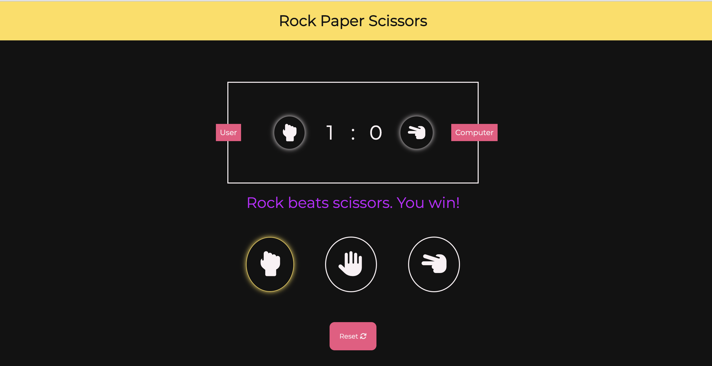

<!-- PROJECT LOGO -->
 

  
  <h3 align="center">Rock Paper Scissors</h3>
  

     
    <a href="https://andreinadsc.github.io/rock-paper-scissors/">View Demo</a>
    ·
    <a href="https://github.com/andreinadsc/rock-paper-scissors/issues">Report Bug</a>
  

  
Table of Contents

  <ol>
    <li>
      <a href="#about-the-project">About The Project</a>
    </li>
    <li>
        <a href="#built-with">Built With</a>
    </li>
    <li>
      <a href="#getting-started">Getting Started</a>
    </li>
    <li><a href="#contact">Contact</a></li>
  </ol>

## About The Project

A simple rock paper scissors game

(<a href="#readme-top">back to top</a>)

## Built With

* 
* 
* 

(<a href="#readme-top">back to top</a>)

<!-- GETTING STARTED -->
## Getting Started

You begin each round by selecting rock, paper, or scissors. 
You can play as many rounds as you want, and you can even reset the score to restart.

<!-- CONTACT -->

## Contact

María Andreina Da Silva - andreinadsc@gmail.com

(<a href="#readme-top">back to top</a>)
